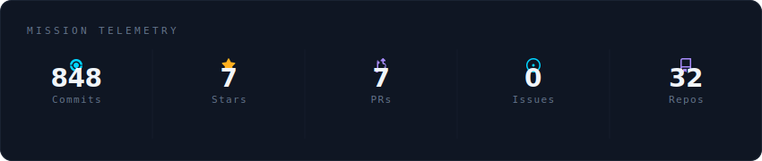

<!-- Galaxy Profile README Template
     Customize this file with your own info, then rename it to README.md
     in your GitHub profile repo (github.com/YOUR_USERNAME/YOUR_USERNAME).
     The SVG paths below point to assets/generated/ which are auto-generated
     by the GitHub Actions workflow or by running: python -m generator.main -->

  

 

  

 

  

 

  

 

<strong>More about me</strong>

 

Hello, I'm Hugo, a software developer with experience in the development world since 2021. I have a degree as a Computer Technician and I'm also certified in the Gostack Bootcamp by Rocketseat.

🔭 Currently, I'm working as a backend software developer at Grupo Boticário, where I use my skills in Node.js, NestJS, MongoDB, TypeScript to create robust and scalable solutions that serve different countries, such as Portugal and Colombia.

💻 I have experience in projects for major Brazilian companies, working as a backend developer in Node.js at various stages of development. My responsibilities include implementing new features, maintaining legacy code, and carrying out extensive refactoring to ensure future maintainability of the project. I have also contributed to the development of dashboards for observability and application monitoring, as well as participated in the implementation of systems designed to support multiple countries and languages, ensuring scalability and adaptability for diverse markets.

🎯 My focus is on backend development. My goal is to gain in-depth knowledge of design patterns and software architecture to become a Backend Specialist. I also strive to contribute to the business side of the teams I work with, focusing on usability and staying well onboarded with business rules to deliver greater value in every project.

💡 I am a determined, curious person who easily adapts to different contexts and projects. I see challenges as opportunities for learning and I am resilient when solving problems. I believe in the importance of knowledge sharing within a team and I'm always open to help and receive help.

🚀 My objective is to work on projects that have purpose and challenge me both as a developer and as an individual. I strive to contribute to the success of teams and the development of impactful solutions.

**Currently at** Grupo Boticário — Rio de Janeiro, Brazil

 

  <!--  -->
  
  

